<h1 style="text-decoration: none; border-bottom: none;">Battleship Game</h1>
<h3>Ahoooooy Sailors! Ready to navigate some rough waters?</h3>


#### ****Visit the live project below.****

  <a href="https://battleshipv2-1cb73689a3df.herokuapp.com/" style="text-decoration: none;">👉 Click Here.</a>
 


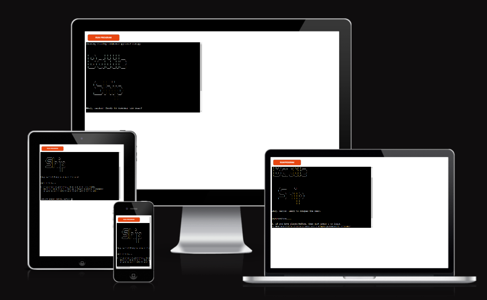

## Content

## Table of Contents
- [Project Goals](#project-goals)
  - [Site Owner Goals](#site-owner-goals)
 [User Experience](#user-experience)
    * [User Stories](#user-stories)
    * [User Manual](#user-manual)    
- [Flow Chart](#flowchart)
- [Design](#design)
- [Game Features](#game-features)
    * [Game Settings](#game-settings)
- [Testing](#testing)
    * [Manual Testing](#manual-testing)
    * [Validator Testing](#validator-testing)
- [Bugs & Fixes](#bugs-fixes)
- [Technologies Used](#technologies-used)
    * [Dependencies](#dependencies)
    * [Installation (Cloning the Project)](#installation-cloning-the-project)
    * [Python Libraries Used](#python-libraries-used)
- [Deployment](#deployment)
- [Credits](#credits)
- [Acknowledgments](#acknowledgments)


## Project Goals

- Battleships is a classic game of strategy and wit. Played on a ruled grid, whether on paper or board, 
- the player must locate a concealed fleet of warships. By taking shots at specific grid coordinates,
- the objective is to identify and sink the entire hidden fleet.


## site-owner-goals


* Create a Battleship game that is intuitive and engaging for the user.
* Ensure that new users can effortlessly sign up.
* Ensure that existing users can log in smoothly.
* Handle and display errors in a clear manner to the user.
* Allow users the option to restart the game.

[Back to top](#)


## User Experience


### User Stories


- Play the Battleship game solo and find the hidden ships.
- Be able to sign up as a new user.
- Be able to login as an existing user.
- Be able to restart the game at the end of each match.
- Experience the game seamlessly across different devices.

[Back to top](#)


### User Manual


**If you're new to Battleship check out this link** 👉 https://en.wikipedia.org/wiki/Battleship

* Start with a Sailor Sign in / registration for new Sailors, and simple Login for returning players,
  I've kept it very simple, ensuring you can get back into the battle again.

* Once you've been greeted by the sailor prompt and you're all set,
    it's time to decide on your game's layout. For a quick game, the 5x5 board is a perfect choice.

* After setting up the board prompt, decide how many ships you'd like
    to hide on the game board. Remember: more ships on a smaller board means more chances to sink ships.

* Next, determine the number of turns (or tries) you want for hunting those hidden ships.
    You can choose anywhere between 5-10 turns per game.

    **Here's a hint:**
    
   *   If you've chosen the 5x5 board with 6 ships and go for 10 turns,
   *   get ready for an exciting round filled with sunken ships.
   
   *   Once your game has ended, the outcomes of your successful sinkings are 
   *   displayed on the main game board, and ships left.
    
       - Then, we'll ask: 
       - Ready for another round on the seas?


[Back to top](#)


## Flowchart

👇 CLICK TO EXPAND BELOW <details><summary>A graphical representation of the game process</summary> 

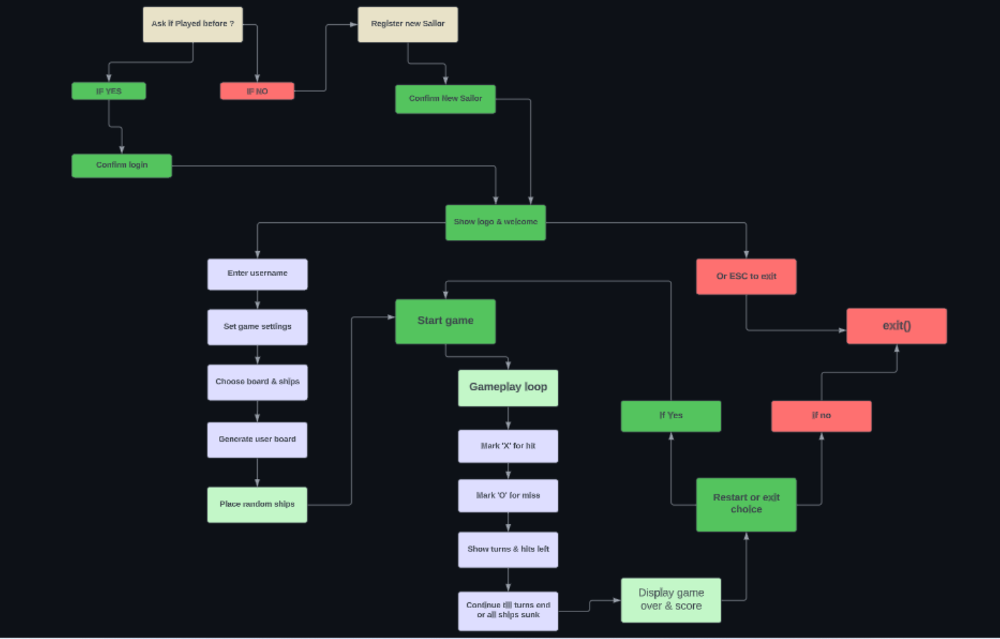

[Back to top](#)

</details>


<br><br>


## Design
<br>

 * **Simplicity:** The design is straightforward,very simple and user-friendly.
 * **Clean interface:** Using the 'clear' function, the screen is tidy after each prompt.

<br><br>

[Back to top](#)

<br><br>

## Game Features

  * ***Sign in / registration for new Sailors, and simple Login for returning players.***  
<br>

  
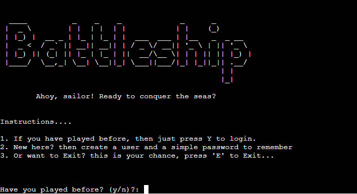


[Back to top](#)


### Game settings

<br>

1. **Prompted with the question if you ever sailed with us before?** 
2. **If you have sailed with us before you will simply login again.**
3. **If not you will be asked to create your Sail account**

### Then it's of to the internal Game settings you will be asked. 

5. **Choose between a 5x5 or an 8x8 board** 
6. **Decide on having between 2 to 6 ships**
7. **Determine how many turns to play**

[Back to top](#)

## Testing 

- Pythontutor excellent for visually understanding and verifying how your code executes.

[Execution Visualization Tool](https://pythontutor.com/cp/composingprograms.html#mode=edit)


### Manual Testing

<details><summary>New signup / login screen.</summary>

| **Feature**  | **Instruction**              | **User Input**           | **Expected Behavior**                   | **Actual Behavior** |
| :---         |    :----:                    |          :---:           |   :---:                                 |        ---:         |
| Game name    | Prompts user for name        | "Mats"                   | Returns the name "Mats"                 | Works as intended   |
|              | Have you played before? (y/n):| Empty input             | Invalid choice! try again.              | Works as intended   |
|              |                              | 12345678910              | Invalid choice! try again.              | Works as intended   | 

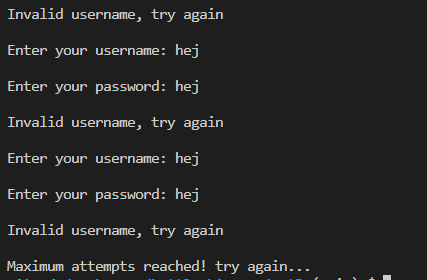
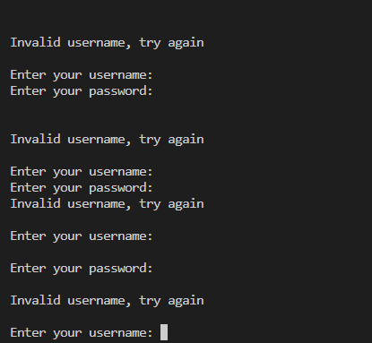

</details><br>


<details><summary>Username prompt old is removed from the project.</summary>

| **Feature**  | **Instruction**              | **User Input**           | **Expected Behavior**                   | **Actual Behavior** |
| :---         |    :----:                    |          :---:           |   :---:                                 |        ---:         |
| Game name    | Prompts user for name        | "Mats"                   | Returns the name "Mats"                 | Works as intended   |
|              | Please enter your name:      | Empty input              | Every sailor has a name? Try again!     | Works as intended   |
|              |                              | 12345678910              | Every sailor has a name? Not a number!  | Works as intended   | 

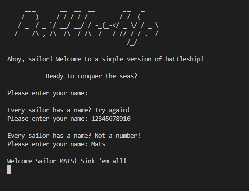


</details><br>

<details><summary>Select board size (5x5 or 8x8)</summary>

| **Feature**  | **Instruction**              | **User Input**           | **Expected Behavior**                   | **Actual Behavior** |
| :---         |    :----:                    |          :---:           |   :---:                                 |        ---:         |
| Board size   | Prompts user for 5x5 or 8x8 board| "5" or "8"           | Returns correct size                    | Works as intended   |
|              | Select board size (5x5 or 8x8): | Empty input           | Please select a valid! board size (5x5 or 8x8)     | Works as intended   |
|              |                              | 1111              | invalid size. Please choose between (5x5 or 8x8)?  | Works as intended   | 

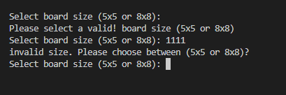


</details><br>

<details><summary>Number of ships</summary>

| **Feature**  | **Instruction**              | **User Input**           | **Expected Behavior**                   | **Actual Behavior** |
| :---         |    :----:                    |          :---:           |   :---:                                 |        ---:         |
| Number of ships | Choose the number of ships? (2-6):| "2","3","4" "6"      |  Returns correct number (5 or 10)       | Works as intended   |
|              |                              | Empty input              |  Please enter a valid number between 2 and 6   | Works as intended   |
|              |                              | "8" "9"                  |  Invalid number! Please choose between 2 and 6 ships? | Works as intended   | 

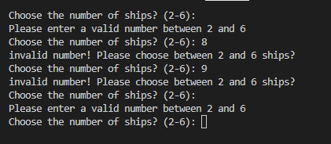


</details><br>


<details><summary>Number of turns ? </summary>

| **Feature**  | **Instruction**              | **User Input**           | **Expected Behavior**                   | **Actual Behavior** |
| :---         |    :----:                    |          :---:           |   :---:                                 |        ---:         |
| Number of turns ? | How many turns ? (5-10):| "5" or "10"               | Returns correct size                    | Works as intended   |
|              |                              | Empty input             | Please enter a valid number between (5 and 10) | Works as intended   |
|              |                              | 1                     | invalid turns! Select a number from (5 to 10)? | Works as intended   | 

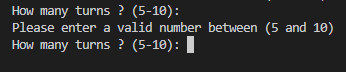
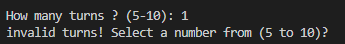

</details><br>

<details><summary>Choose Row/Column (board size for test is 5x5)</summary>

| **Feature**  | **Instruction**              | **User Input**           | **Expected Behavior**                   | **Actual Behavior** |
| :---         |    :----:                    |          :---:           |   :---:                                 |        ---:         |
| Choose a row | Choose a row (0-5):          | "5"                      | Returns correct row                     | Works as intended   |
| Choose a col | Choose a col (0-5):          | "4"                      | Returns correct col                     | Works as intended   |
|              |                              | Empty input              | Please enter a valid number             | Works as intended   | 
|              |                              | "9"  "10"                | Please pick a valid number (1-5)        | Works as intended   | 

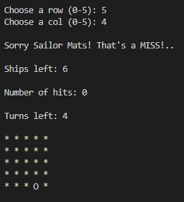
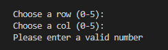

</details><br>


<details><summary>Ships left, Hits, Turns left</summary>

| **Feature**  | **Expected Behavior**        | **Actual Result**      |   
| :---         |    :----:                    |          ---:          |  
| Ships left: 6|   Ships left: 5              | Not working as intended| 
| Numbers of Hits: 1  | Numbers of Hits: 1    | Works as intended      | 
| Turns left: 2|    Turns left: 2             | Works as intended      |
|              |                              |                        | 


- **Issue with ships remaining** 
- Plan of action: When a ship is hit,remove one ship from count. 

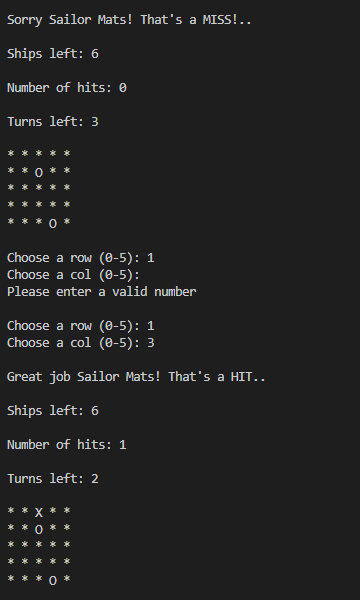

**Issue with ships remaining**
- Resolved.

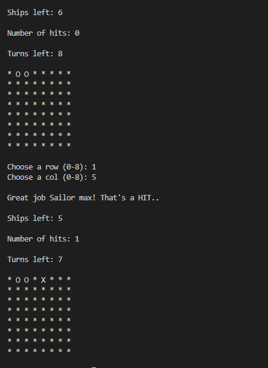

</details><br>

<details><summary>Restart.</summary>

| **Feature**  | **Instruction**              | **User Input**           | **Expected Behavior**                   | **Actual Behavior** |
| :---         |    :----:                    |          :---:           |   :---:                                 |        ---:         |
| Restart the game| Ahoooy Sailor! try again? (y/n):| "n"                | Thank you for playing!                  | Works as intended   |
|              | Ahoooy Sailor! try again? (y/n):| "y"                   |                                         | Works as intended   |
|              | Ahoooy Sailor! try again? (y/n):| Empty input           | Please confirm with (y/n):           | Not working as intended! Works as intended |
|              |                              |               |               | | 

- 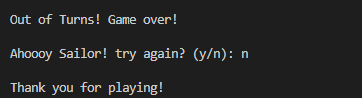

- 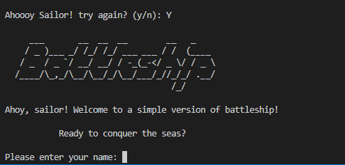

- **Issue with restart prompt on Empty input.** 

 - 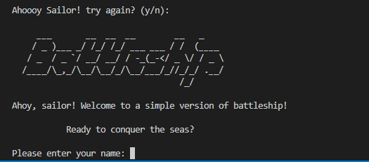


- **Issue with restart prompt on Empty input Resolved!** 

- 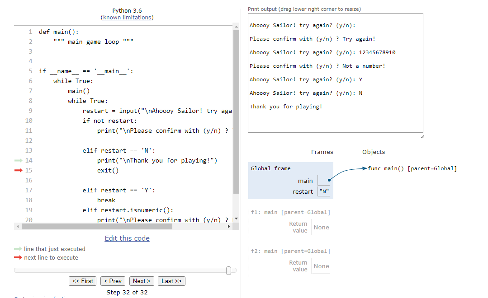

- 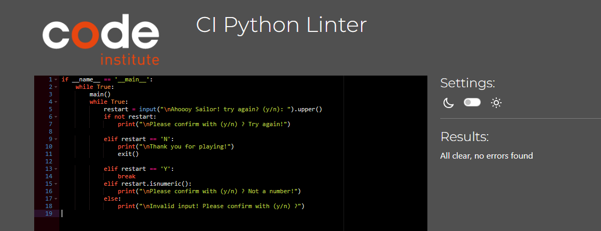
</details><br>

[Back to top](#)


### Validator Testing

***keep your Python code neat and PEP 8 friendly.***
[Code Linter](https://pep8ci.herokuapp.com/)

<details><summary>CI Python Linter - Result</summary>

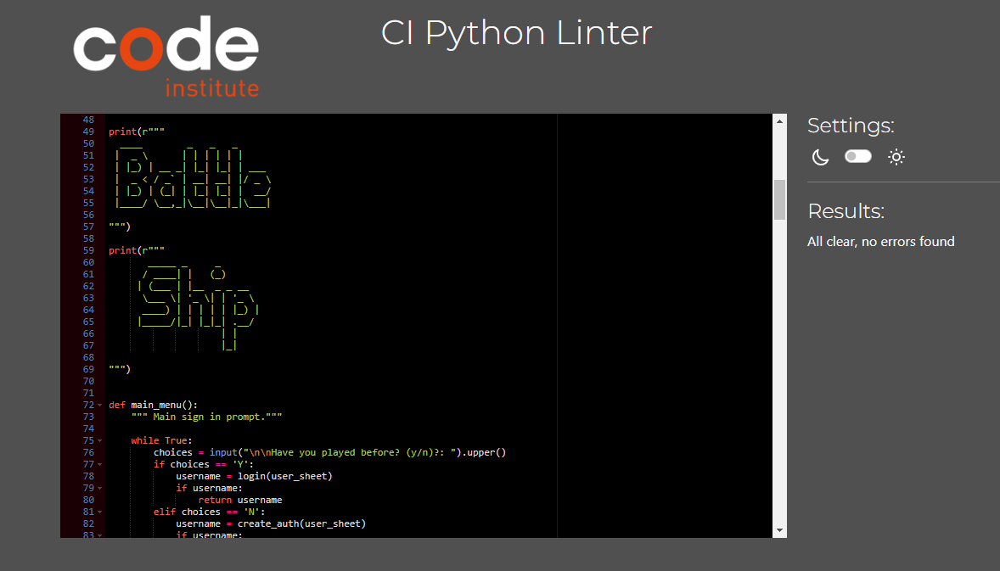

[Back to top](#)

</details><br>


## Bugs & Fixed Bugs

### Stuck in a login loop, Invalid username.

<details><summary>login_test_invalid_username_loop</summary>


https://bobbyhadz.com/blog/python-username-password-input-3-attempts


[Back to top](#)
</details>

<details><summary>Very good examples how to setup bccrypt in python.</summary>

https://python.hotexamples.com/examples/bcrypt/-/hashpw/python-hashpw-function-examples.html
https://stackabuse.com/hashing-passwords-in-python-with-bcrypt/
https://www.youtube.com/watch?v=hNa05wr0DSA
https://www.makeuseof.com/tag/encryption-terms/
https://onebite.dev/snippet/python
https://onebite.dev/how-to-make-bcrypt-checkpw-function-work/
https://www.programcreek.com/python/example/81834/bcrypt.hashpw 

</details>


<details><summary>Images of the change to bccrypt</summary>

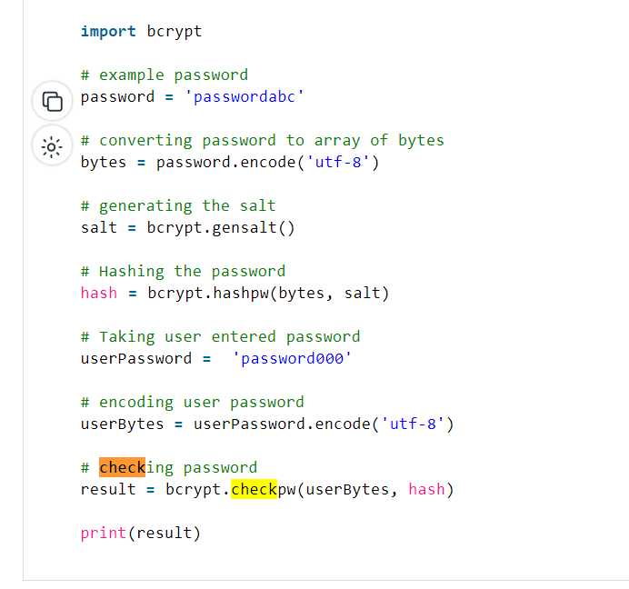

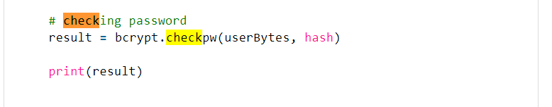

https://saturncloud.io/blog/how-to-use-the-bcrypt-algorithm-within-the-encrypt-function-in-mysql-for-verifying-passwords/


</details>

<details><summary>Fetching the password. Didn't get it to work fully in the end so abandoned the use of Argon2. </summary>

https://inquiryum.com/modules/nodejs%20module/Hashing-Passwords-&-Argon2/


https://www.youtube.com/watch?v=eCBUuu7BPn4
</details>

<details><summary>Wrong referenching in the turns_of_play = number_of_turns()</summary>

- 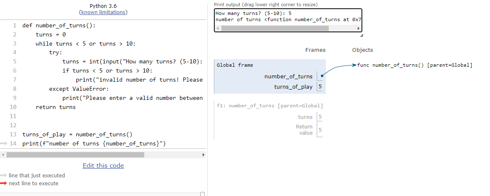
- Wrong referenching in the turns_of_play = number_of_turns()  
- print(f"number of turns {turns_of_play}")  # wrong referenching <---- turns_of_play! 

</details><br>

<details><summary>Corrected Wrong referenching in the turns_of_play</summary>

- 
- Wrong referenching in the turns_of_play = number_of_turns()  
- print(f"number of turns {turns_of_play}")  # wrong referenching <---- turns_of_play! 

</details><br>

<details><summary>Printing the board and and hiding the ships.</summary>


- 


```python
def print_board(board):
    """ Display the game board in the terminal """
    for i, row in enumerate(board):
        print_row = []
        for j, cell in enumerate(row):
            if cell == 'S':
                print_row.append('*')
            else:
                print_row.append(cell)
        print(" ".join(print_row))

```


* Linter error message with the code above. 
''' 
	"code": "unused-variable",
	"severity": 4,
	"message": "Unused variable 'i'",
	"source": "pylint",
			
	"code": "unused-variable",
	"severity": 4,
	"message": "Unused variable 'j'",
	"source": "pylint",
	"startLineNumber": 135,
	'''
* Linter error message resolved. 
 '''
 for row in (board):
        print_row = []
        for cell in (row):
            if cell == 'S':
                print_row.append('*')
            else:
                print_row.append(cell)
        print(" ".join(print_row))
        '''

- 


</details><br>


<details><summary>Tested function using pythonTutor for step-by-step validation 
checking the cells for hit or miss.</summary>

```python

board_size = 5
total_ships = 10
name = "john"


board = build_board(board_size)
board_with_ships = ships_placement(board, total_ships)


def hit_or_miss(board, row, col):
    if board[row][col] == 'S':
        print(f"Great job Sailor {name}! That's a HIT..")
        return True
    return False


row, col = randint(0, board_size - 1), randint(0, board_size - 1)
test_hit = hit_or_miss(board_with_ships, row, col)


if test_hit:
    board_with_ships[row][col] = 'X'
else:
    board_with_ships[row][col] = 'M'
print_board(board_with_ships)


```
</details><br>

<details><summary>New usersname prompt with validation!</summary>


- More about isnumeric.
- https://stackoverflow.com/questions/63973777/cant-forbid-numbers-from-a-username-that-includes-alphabetical-characters

- 


- 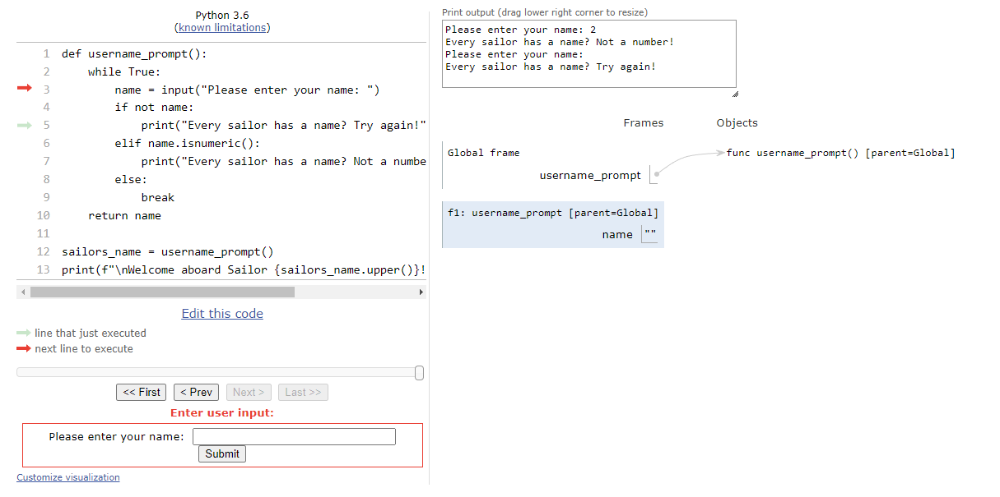  

</details><br>

<details><summary>Restart loop</summary>

- restart game loop i found. 

- 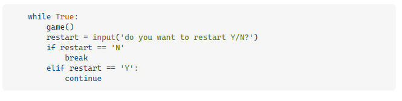
 - https://stackoverflow.com/questions/41718538/how-do-i-insert-a-restart-game-option

- was the same as inside of the game at the end, just looping on 'Y'
- 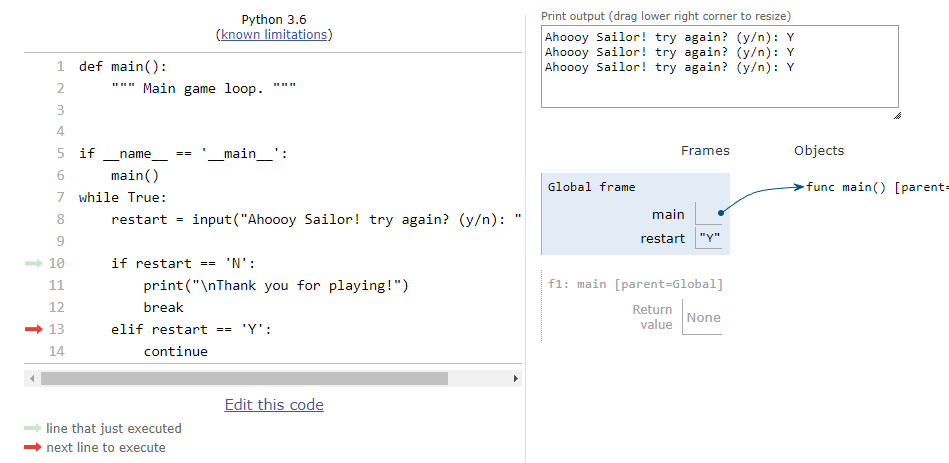

- 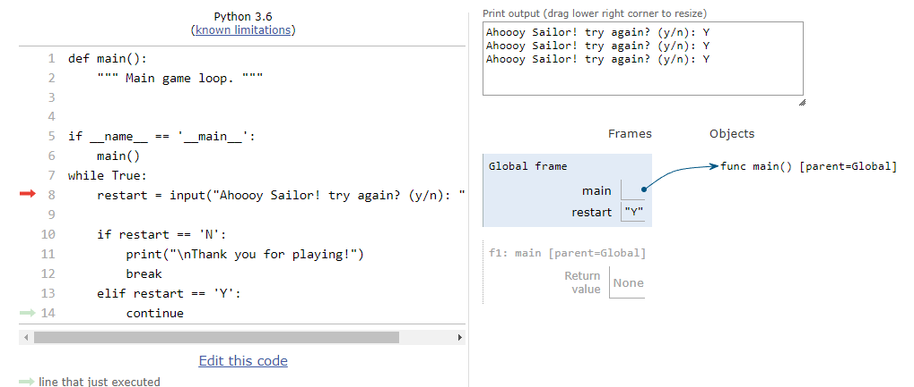

- not looping back to try again jumps back to run main again.
- 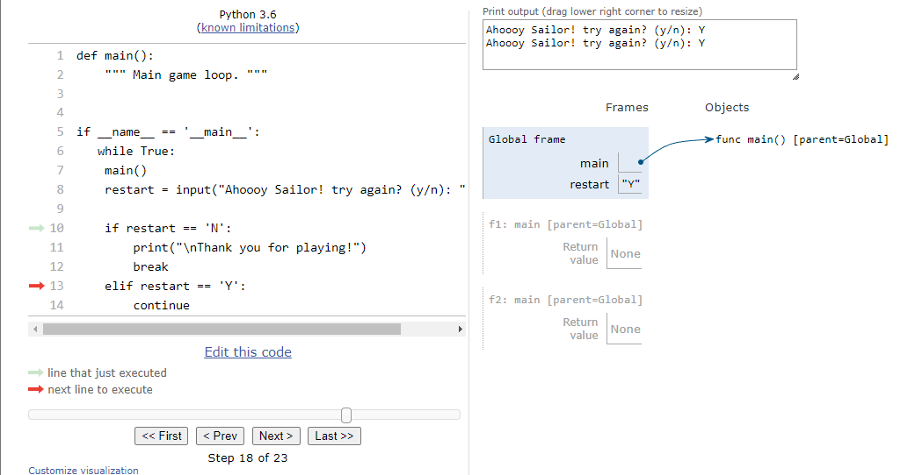

- 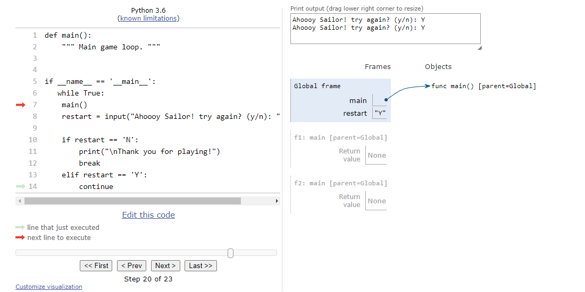

</details><br>

[Back to top](#)


## Technologies used

[Python](https://www.python.org/)  -  The primary programming language for game development.

[Editor - VScode](https://code.visualstudio.com/)  -  All coding was conducted within this editor.

[Back to top](#)


### Dependencies
    
   requirements.txt file contains following libraries: 

- gspread
- oauth2client
- bcrypt==3.2.0


## Installation (Cloning the Project)

1. Clone the repository.
2. Rename your repository, if desired.
3. Navigate to the project directory.
4. Run the command `pip install -r requirements.txt` in the terminal.

<br>

### Python Libraries Used
   Import os
   Import time
   from random import randint

<br><br>

## Deployment


[Backend Framework - Node.JS](https://nodejs.org/en)  -  Provided backend support for the game.

[Final Hosting Platform - Heroku](https://id.heroku.com/login)  -  The game was ultimately deployed and hosted on this platform.


[Back to top](#)

<br>


## Credits

<details><summary>Alot of good examples how to setup and use ***bccrypt*** in python</summary>  

* https://python.hotexamples.com/examples/bcrypt/-/hashpw/python-hashpw-function-examples.html
* https://stackabuse.com/hashing-passwords-in-python-with-bcrypt/
* https://www.youtube.com/watch?v=hNa05wr0DSA
* https://www.makeuseof.com/tag/encryption-terms/
* https://onebite.dev/snippet/python
* https://onebite.dev/how-to-make-bcrypt-checkpw-function-work/
* https://www.programcreek.com/python/example/81834/bcrypt.hashpw 


[Back to top](#)

</details><br>

<details><summary>Login / Registration prompt</summary>  
<br>

- After revisiting the "love sandwich" project, I searched the internet until I found something 
- that perfectly matched what I had in mind to enhance the project and make it complete.

<br>

* https://replit.com/talk/share/A-Simple-Login-System-using-Google-Sheets-API/20950
* https://www.w3schools.com/python/trypython.asp?filename=demo_ref_string_strip


[Back to top](#)

</details><br>


<details><summary>Password hashing</summary>  


https://pypi.org/project/argon2-cffi/

https://stackoverflow.com/questions/58431973/argon2-library-that-hashes-passwords-without-a-secret-and-with-a-random-salt-tha


[Back to top](#)

</details><br>


<details><summary>Restart the game</summary>  


- https://stackoverflow.com/questions/41718538/how-do-i-insert-a-restart-game-option

- https://stackoverflow.com/questions/63973777/cant-forbid-numbers-from-a-username-that-includes-alphabetical-characters
  

[Back to top](#)

</details><br>

<details><summary>To construct the board</summary>  
  

- https://www.programcreek.com/python/?CodeExample=print+board

- https://stackoverflow.com/questions/63318514/how-output-of-printprint-boardboard-is-printed-like-a-matrix-but-not-like-a


[Back to top](#)

</details><br>


<details><summary>The turns</summary>  


- https://trinket.io/python/051179b6d3

- https://discuss.codecademy.com/t/excellent-battleship-game-written-in-python/430605


[Back to top](#)

</details><br>


## Acknowledgments

I would like to acknowledge my mentor Mo Shami, for staring me in right direction.