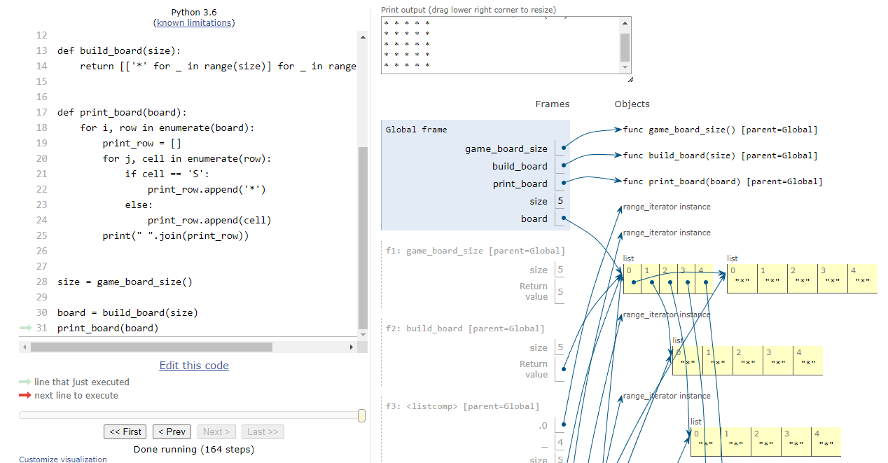

<h1 style="text-decoration: none; border-bottom: none;">Battleship Game ⚓️</h1>
<h3>Ahoooooy Sailors! Ready to navigate some rough waters?</h3>

### Visit the live project below.

* Your dependencies must be placed in the `requirements.txt` file


## Flow chart

<details><summary>A graphical representation of the game process</summary>


</details>


## User Experience

 **If you're new to Battleship check out this link** 👉 https://en.wikipedia.org/wiki/Battleship

 1. Kick things off with a simple **username prompt** directly on the welcome screen
    i've kept it straightforward so you can dive right in.


 2. Once the **username prompt** has greeted you and you're all set,
    decide on your game's layout. For a quick and compact game, the 5x5 board 
    is your go-to choice. 


 3. With the **board prompt** out of the way, it's time to decide how many ships you'd like 
    to hide on **game board?** more ships on a smaller board means sinkings in abundance.


 4. Next, determine how many turns (or tries) you want to hunt down those elusive ships. 
    from anywhere between 5-10 turns per game. 
    **Here's a hint:**
    If you have chosen the 5x5 board with 6 ships and go for 10 turns, 
    prepare for a sinking bonanza and a large ship graveyard.


 5. Finally, after completing your game, the outcomes of your successful sinkings and misses 
    will be shown the result. 
    Following this, we will pose the big question? Ready to go another round?


## Game Features

 - ***Welcome scene:*** Greeted with the logo and a welcome message.
 - ***Username:*** Quickly set up by entering your username.

   

### Game settings

1. **Choose between a 5x5 or an 8x8 board** 
2. **Decide on having between 2 to 6 ships**
3. **Determine how many turns to play**


## Design

- **Simplicity:** The design is straightforward,very simple and user-friendly.
- **Clean interface:** Using the 'clear' function, the screen is tidy after each prompt.


## Technologies & Deployment Used


[Python](https://www.python.org/)  -  The primary programming language for game development.

[Editor - VScode](https://code.visualstudio.com/)  -  All coding was conducted within this editor.

[Intermediate Deployment - CodeAnyWhere ](https://codeanywhere.com/solutions/collaborate)  -  Initial deployment and testing took place here.

[Backend Framework - Node.JS](https://nodejs.org/en)  -  Provided backend support for the game.

[Final Hosting Platform - Heroku](https://id.heroku.com/login)  -  The game was ultimately deployed and hosted on this platform.


## Testing 

[Execution Visualization Tool](https://pythontutor.com/cp/composingprograms.html#mode=edit)
- Excellent for visually understanding and verifying how your code executes.

[Code Linter](https://pep8ci.herokuapp.com/)
- keep your Python code neat and PEP 8 friendly.

<details><summary>Wrong referenching in the turns_of_play = number_of_turns()</summary>


- Wrong referenching in the turns_of_play = number_of_turns()  
- print(f"number of turns {turns_of_play}")  # wrong referenching <---- turns_of_play! 

</details>

<details><summary>Corrected Wrong referenching in the turns_of_play</summary>


- Wrong referenching in the turns_of_play = number_of_turns()  
- print(f"number of turns {turns_of_play}")  # wrong referenching <---- turns_of_play! 

</details>

<details><summary>Printing the board and and hiding the ships.</summary>





```python
def print_board(board):
    """ Display the game board in the terminal """
    for i, row in enumerate(board):
        print_row = []
        for j, cell in enumerate(row):
            if cell == 'S':
                print_row.append('*')
            else:
                print_row.append(cell)
        print(" ".join(print_row))

```
</details>


<details><summary>Tested function using pythonTutor for step-by-step validation 
checking the cells for hit or miss.</summary>

```python

board_size = 5
total_ships = 10
name = "john"


board = build_board(board_size)
board_with_ships = ships_placement(board, total_ships)


def hit_or_miss(board, row, col):
    if board[row][col] == 'S':
        print(f"Great job Sailor {name}! That's a HIT..")
        return True
    return False


row, col = randint(0, board_size - 1), randint(0, board_size - 1)
test_hit = hit_or_miss(board_with_ships, row, col)


if test_hit:
    board_with_ships[row][col] = 'X'
else:
    board_with_ships[row][col] = 'M'
print_board(board_with_ships)


```
</details>


  

## Bugs


## Credits
  ***Helped to build out the board***

- https://www.programcreek.com/python/?CodeExample=print+board

- https://stackoverflow.com/questions/63318514/how-output-of-printprint-boardboard-is-printed-like-a-matrix-but-not-like-a

#### The turns 

https://trinket.io/python/051179b6d3


## Acknowledgments