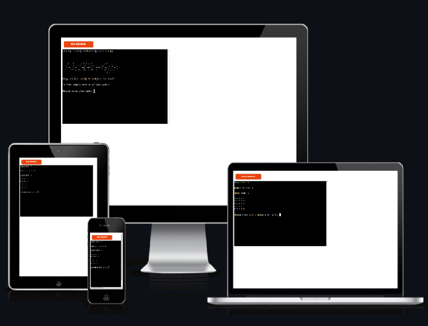
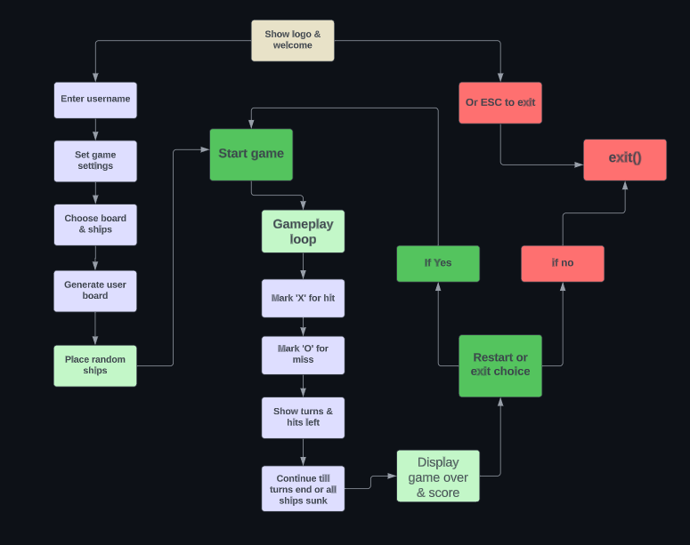
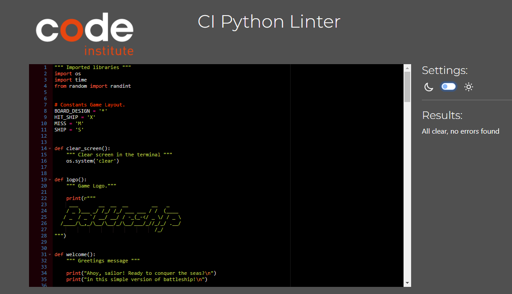

<h1 style="text-decoration: none; border-bottom: none;">Battleship Game</h1>
<h3>Ahoooooy Sailors! Ready to navigate some rough waters?</h3>


#### ****Visit the live project below.****

  <a href="https://battleshipv2-80486db18913.herokuapp.com/">👉 Click Here.</a>
 




## Content


* [Flow Chart](#flow-chart)
* [User Experience](#user-experience)
* [Game Features](#game-features)
* [Game Settings](#game-settings)
* [Design](#design)
* [Technologies & Deployment Used](#technologies--deployment-used)
* [Testing](#testing) 
* [Credits](#credits)
* [Acknowledgments](#acknowledgments)


## Flow chart

👇 CLICK TO EXPAND BELOW <details><summary>A graphical representation of the game process</summary> 


</details>


## User Experience

 **If you're new to Battleship check out this link** 👉 https://en.wikipedia.org/wiki/Battleship

 1. Kick things off with a simple **username prompt** directly on the welcome screen
    i've kept it straightforward so you can dive right in.


 2. Once the **username prompt** has greeted you and you're all set,
    decide on your game's layout. For a quick and compact game, the 5x5 board 
    is your go-to choice. 


 3. With the **board prompt** out of the way, it's time to decide how many ships you'd like 
    to hide on **game board?** more ships on a smaller board means sinkings in abundance.


 4. Next, determine how many turns (or tries) you want to hunt down those elusive ships. 
    from anywhere between 5-10 turns per game. 
    **Here's a hint:**
    If you have chosen the 5x5 board with 6 ships and go for 10 turns, 
    prepare for a sinking bonanza and a large ship graveyard.


 5. Finally, after completing your game, the outcomes of your successful sinkings  
    is displayed over the main game board with number of turns and ships left.  
    Following this, we will pose the big question? Ready to go another round?


## Game Features

  * ***Welcome scene:*** Greeted with the logo and a welcome message.
  * ***Username:*** Quickly set up by entering your username.

   


### Game settings

1. **Choose between a 5x5 or an 8x8 board** 
2. **Decide on having between 2 to 6 ships**
3. **Determine how many turns to play**


## Design


- **Simplicity:** The design is straightforward,very simple and user-friendly.
- **Clean interface:** Using the 'clear' function, the screen is tidy after each prompt.


## Technologies & Deployment Used


[Python](https://www.python.org/)  -  The primary programming language for game development.

[Editor - VScode](https://code.visualstudio.com/)  -  All coding was conducted within this editor.

[Backend Framework - Node.JS](https://nodejs.org/en)  -  Provided backend support for the game.

[Final Hosting Platform - Heroku](https://id.heroku.com/login)  -  The game was ultimately deployed and hosted on this platform.


## Testing 


[Execution Visualization Tool](https://pythontutor.com/cp/composingprograms.html#mode=edit)
- Excellent for visually understanding and verifying how your code executes.

[Code Linter](https://pep8ci.herokuapp.com/)
- keep your Python code neat and PEP 8 friendly.

<details><summary>CI Python Linter - Result</summary>


</details><br>


### User Story testing - manual testing


<details><summary>Username prompt</summary>

| **Feature**  | **Instruction**              | **User Input**           | **Expected Behavior**                   | **Actual Behavior** |
| :---         |    :----:                    |          :---:           |   :---:                                 |        ---:         |
| Game name    | Prompts user for name        | "Mats"                   | Returns the name "Mats"                 | Works as intended   |
|              | Please enter your name:      | Empty input              | Every sailor has a name? Try again!     | Works as intended   |
|              |                              | 12345678910              | Every sailor has a name? Not a number!  | Works as intended   | 


</details><br>

<details><summary>Select board size (5x5 or 8x8)</summary>

| **Feature**  | **Instruction**              | **User Input**           | **Expected Behavior**                   | **Actual Behavior** |
| :---         |    :----:                    |          :---:           |   :---:                                 |        ---:         |
| Board size   | Prompts user for 5x5 or 8x8 board| "5" or "8"           | Returns correct size                    | Works as intended   |
|              | Select board size (5x5 or 8x8): | Empty input           | Please select a valid! board size (5x5 or 8x8)     | Works as intended   |
|              |                              | 1111              | invalid size. Please choose between (5x5 or 8x8)?  | Works as intended   | 


</details><br>

<details><summary>Number of ships</summary>

| **Feature**  | **Instruction**              | **User Input**           | **Expected Behavior**                   | **Actual Behavior** |
| :---         |    :----:                    |          :---:           |   :---:                                 |        ---:         |
| Number of ships | Choose the number of ships? (2-6):| "2","3","4" "6"      |  Returns correct number (5 or 10)       | Works as intended   |
|              |                              | Empty input              |  Please enter a valid number between 2 and 6   | Works as intended   |
|              |                              | "8" "9"                  |  Invalid number! Please choose between 2 and 6 ships? | Works as intended   | 


</details><br>


<details><summary>Number of turns ? </summary>

| **Feature**  | **Instruction**              | **User Input**           | **Expected Behavior**                   | **Actual Behavior** |
| :---         |    :----:                    |          :---:           |   :---:                                 |        ---:         |
| Number of turns ? | How many turns ? (5-10):| "5" or "10"               | Returns correct size                    | Works as intended   |
|              |                              | Empty input             | Please enter a valid number between (5 and 10) | Works as intended   |
|              |                              | 1                     | invalid turns! Select a number from (5 to 10)? | Works as intended   | 


</details><br>

<details><summary>Choose Row/Column (board size for test is 5x5)</summary>

| **Feature**  | **Instruction**              | **User Input**           | **Expected Behavior**                   | **Actual Behavior** |
| :---         |    :----:                    |          :---:           |   :---:                                 |        ---:         |
| Choose a row | Choose a row (0-5):          | "5"                      | Returns correct row                     | Works as intended   |
| Choose a col | Choose a col (0-5):          | "4"                      | Returns correct col                     | Works as intended   |
|              |                              | Empty input              | Please enter a valid number             | Works as intended   | 
|              |                              | "9"  "10"                | Please pick a valid number (1-5)        | Works as intended   | 


</details><br>


<details><summary>Ships left, Hits, Turns left</summary>

| **Feature**  | **Expected Behavior**        | **Actual Result**      |   
| :---         |    :----:                    |          ---:          |  
| Ships left: 6|   Ships left: 5              | Not working as intended| 
| Numbers of Hits: 1  | Numbers of Hits: 1    | Works as intended      | 
| Turns left: 2|    Turns left: 2             | Works as intended      |
|              |                              |                        | 


- **Issue with ships remaining** 
- Plan of action: When a ship is hit,remove one ship from count. 


**Issue with ships remaining**
- Resolved.


</details><br>

<details><summary>Restart.</summary>

| **Feature**  | **Instruction**              | **User Input**           | **Expected Behavior**                   | **Actual Behavior** |
| :---         |    :----:                    |          :---:           |   :---:                                 |        ---:         |
| Restart the game| Ahoooy Sailor! try again? (y/n):| "n"                | Thank you for playing!                  | Works as intended   |
|              | Ahoooy Sailor! try again? (y/n):| "y"                   |                                         | Works as intended   |
|              | Ahoooy Sailor! try again? (y/n):| Empty input           | Please confirm with (y/n):           | Not working as intended! Works as intended |
|              |                              |               |               | | 

- 

- 

- **Issue with restart prompt on Empty input.** 

 - 


- **Issue with restart prompt on Empty input Resolved!** 

- 

- 
</details><br>


- helpful site for the markdown tables and cells.
- https://www.markdownguide.org/extended-syntax/#:~:text=for%20more%20information.-,Tables,either%20end%20of%20the%20row.&text=Cell%20widths%20can%20vary%2C%20as%20shown%20below.<br><br>

<details><summary>Wrong referenching in the turns_of_play = number_of_turns()</summary>

- 
- Wrong referenching in the turns_of_play = number_of_turns()  
- print(f"number of turns {turns_of_play}")  # wrong referenching <---- turns_of_play! 

</details><br>

<details><summary>Corrected Wrong referenching in the turns_of_play</summary>

- 
- Wrong referenching in the turns_of_play = number_of_turns()  
- print(f"number of turns {turns_of_play}")  # wrong referenching <---- turns_of_play! 

</details><br>

<details><summary>Printing the board and and hiding the ships.</summary>


- 


```python
def print_board(board):
    """ Display the game board in the terminal """
    for i, row in enumerate(board):
        print_row = []
        for j, cell in enumerate(row):
            if cell == 'S':
                print_row.append('*')
            else:
                print_row.append(cell)
        print(" ".join(print_row))

```


### Linter error message with the code above. 
''' 
	"code": "unused-variable",
	"severity": 4,
	"message": "Unused variable 'i'",
	"source": "pylint",
			
	"code": "unused-variable",
	"severity": 4,
	"message": "Unused variable 'j'",
	"source": "pylint",
	"startLineNumber": 135,
	'''
### Linter error message resolved. 
 '''
 for row in (board):
        print_row = []
        for cell in (row):
            if cell == 'S':
                print_row.append('*')
            else:
                print_row.append(cell)
        print(" ".join(print_row))
        '''

- 


</details><br>


<details><summary>Tested function using pythonTutor for step-by-step validation 
checking the cells for hit or miss.</summary>

```python

board_size = 5
total_ships = 10
name = "john"


board = build_board(board_size)
board_with_ships = ships_placement(board, total_ships)


def hit_or_miss(board, row, col):
    if board[row][col] == 'S':
        print(f"Great job Sailor {name}! That's a HIT..")
        return True
    return False


row, col = randint(0, board_size - 1), randint(0, board_size - 1)
test_hit = hit_or_miss(board_with_ships, row, col)


if test_hit:
    board_with_ships[row][col] = 'X'
else:
    board_with_ships[row][col] = 'M'
print_board(board_with_ships)


```
</details><br>

<details><summary>New usersname prompt with validation!</summary>


- More about isnumeric.
- https://stackoverflow.com/questions/63973777/cant-forbid-numbers-from-a-username-that-includes-alphabetical-characters

- 


-   

</details><br>

<details><summary>Restart loop</summary>

- restart game loop i found. 

- 
 - https://stackoverflow.com/questions/41718538/how-do-i-insert-a-restart-game-option

- was the same as inside of the game at the end, just looping on 'Y'
- 

- 

- not looping back to try again jumps back to run main again.
- 

- 

</details><br>


## Credits

***Restart the game***

- https://stackoverflow.com/questions/41718538/how-do-i-insert-a-restart-game-option

- https://stackoverflow.com/questions/63973777/cant-forbid-numbers-from-a-username-that-includes-alphabetical-characters
  
  ***Helped to construct the board***

- https://www.programcreek.com/python/?CodeExample=print+board

- https://stackoverflow.com/questions/63318514/how-output-of-printprint-boardboard-is-printed-like-a-matrix-but-not-like-a

#### The turns 

- https://trinket.io/python/051179b6d3

- https://discuss.codecademy.com/t/excellent-battleship-game-written-in-python/430605


## Acknowledgments

I would like to acknowledge my mentor Mo Shami, for staring me in right direction.