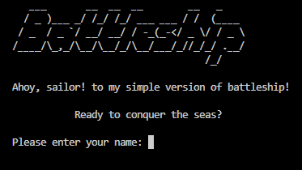

<h1 style="text-decoration: none; border-bottom: none;">Battleship Game ⚓️</h1>
<h3>Ahoooooy Sailors! Ready to navigate some rough waters?</h3>

### Visit the live project below.

* Your dependencies must be placed in the `requirements.txt` file


## Flow chart

<details><summary>This is the flowchart of the game project</summary>


</details>


## User Experience


## Game Features

 - ***Welcome scene:*** Greeted with the logo and a welcome message.
 - ***Username:*** Quickly set up by entering your username.

   

### Game settings

1. **Choose between a 5x5 or an 8x8 board** 
2. **Decide on having between 2 to 6 ships**
3. **Determine how many turns to play**


## Design

- **Simplicity:** The design is straightforward,very simple and user-friendly.
- **Clean interface:** Using the 'clear' function, the screen is tidy after each prompt.


## Technologies & Deployment Used


[Python](https://www.python.org/)  -  The primary programming language for game development.

[Editor - VScode](https://code.visualstudio.com/)  -  All coding was conducted within this editor.

[Intermediate Deployment - CodeAnyWhere ](https://codeanywhere.com/solutions/collaborate)  -  Initial deployment and testing took place here.

[Backend Framework - Node.JS](https://nodejs.org/en)  -  Provided backend support for the game.

[Final Hosting Platform - Heroku](https://id.heroku.com/login)  -  The game was ultimately deployed and hosted on this platform.


## Testing 

[Execution Visualization Tool](https://pythontutor.com/cp/composingprograms.html#mode=edit)
- Excellent for visually understanding and verifying how your code executes.

[Code Linter](https://pep8ci.herokuapp.com/)
- keep your Python code neat and PEP 8 friendly.

<details><summary>Wrong referenching in the turns_of_play = number_of_turns()</summary>


- Wrong referenching in the turns_of_play = number_of_turns()  
- print(f"number of turns {turns_of_play}")  # wrong referenching <---- turns_of_play! 

</details>

<details><summary>Corrected Wrong referenching in the turns_of_play</summary>


- Wrong referenching in the turns_of_play = number_of_turns()  
- print(f"number of turns {turns_of_play}")  # wrong referenching <---- turns_of_play! 

</details>

<details><summary>Printing the board and checking the cells for hit or miss.</summary>


```python
def print_board(board):
    """ Display the game board in the terminal """
    for i, row in enumerate(board):
        print_row = []
        for j, cell in enumerate(row):
            if cell == 'S':
                print_row.append('*')
            else:
                print_row.append(cell)
        print(" ".join(print_row))

```
</details>


## Bugs


## Credits
  ***Helped to build out the board***

- https://www.programcreek.com/python/?CodeExample=print+board

- https://stackoverflow.com/questions/63318514/how-output-of-printprint-boardboard-is-printed-like-a-matrix-but-not-like-a


## Acknowledgments