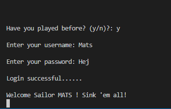
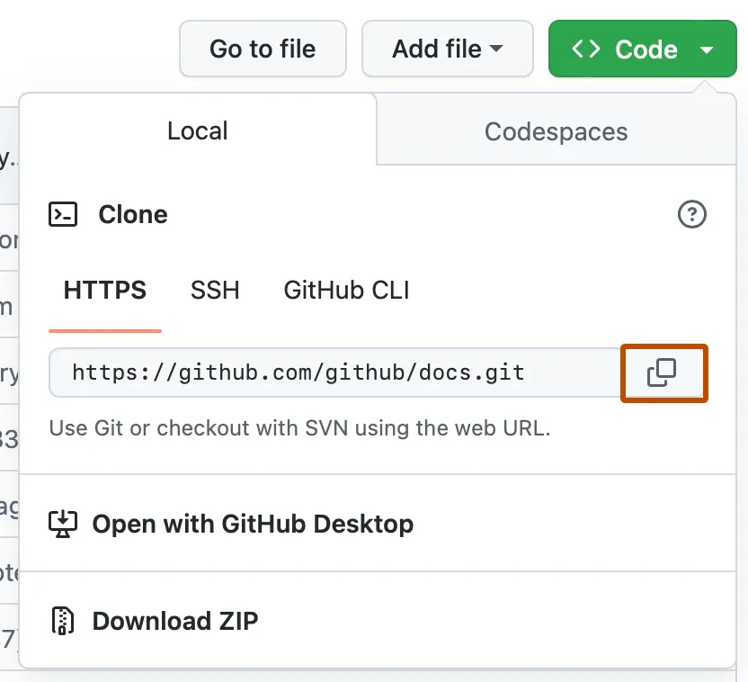

<h1 style="text-decoration: none; border-bottom: none;"><b>Battleship Game</b></h1>
<h3>Ahoooooy Sailors! Ready to navigate some rough waters?</h3>


#

#### ****Visit the live project below.****

  <a href="https://battleshipv2-8b5e10507413.herokuapp.com/" style="text-decoration: none;">👉<b> Click Here.</b></a>
 


# 

<br>

# Table of Contents
- [Project Goals](#project-goals)
- [Site Owner Goals](#site-owner-goals)
- [User Experience](#user-experience)
    - [User Stories](#user-stories)
    - [User stories Manual Testing](User-stories-Manual-Testing)
    - [User Manual](#user-manual)    
- [Flow Chart](#flowchart)
- [Game design](#Gamedesign)
- [Game Features](#game-features)
- [Testing](#testing)
    * [User stories Manual Testing](#manual-testing)
    * [Validator Testing](#validator-testing)
- [Bugs & Fixes](#bugs-fixes)
- [Technologies Used](#technologies-used)
    * [Installation (Cloning the Project)](#installation-cloning-the-project)
    * [Dependencies](#dependencies)
    * [Python Libraries Used](#python-libraries-used)
- [Deployment](#deployment)
- [Credits](#credits)
- [Acknowledgments](#acknowledgments)


<br>

# Project Goals

- Battleships is a classic game of strategy and wit. Played on a ruled grid, whether on paper or board, 
- the player must locate a concealed fleet of warships. By taking shots at specific grid coordinates,
- the objective is to identify and sink the entire hidden fleet.


<br>


# site-owner-goals


* Create a Battleship game that is intuitive and engaging for the user.
* Ensure that new users can effortlessly sign up.
* Ensure that existing users can log in smoothly.
* Handle and display errors in a clear manner to the user.
* Allow users the option to restart the game.

<br>


<br>


# User Experience

### User Stories:

1. **First Prompt**: <br>
Start screen, you're given an option to signup or login. If you have registered before then just login.    
[Manual Testing](#first-prompt)
    
2. **Board Size Selection**: <br>
Choose between a 5x5 or 8x8 board size.<br>
[Manual Testing](#manual-testing-board-size-selection)

3. **Ship Placement**:
    <br>Decide the number of ships you wish to randomly place on your board.
    <br>
    [Manual Testing](#manual-testing-ship-placement)

4. **Turn Selection**:
    <br>Decide the number of turns (tries) you'd like: 5 or 10 turns to locate the ships.
    <br>
    [Manual Testing](#manual-testing-turn-selection)

5. **Ship Count Display**:
    <br>Above the board, the number of remaining ships is shown.
    <br>
    [Manual Testing](#manual-testing-ship-count-display)

6. **Hit Count Display**:
    <br>View the number of successful hits above the board.
    <br>
    [Manual Testing](#manual-testing-hit-count-display)

7. **Turns Left Display**:
    <br>Monitor the number of turns you have left, displayed above the board.
    <br>
    [Manual Testing](#manual-testing-turns-left-display)

8. **Board Display**:
    <br>The board consist of "*" symbols. Hits are displayed by "X" and misses by "M".
    <br>
    [Manual Testing](#manual-testing-board-display)

9. **Endgame**:
    <br>Once all turns are used or all ships are hit, you're asked if you'd like to play again.
    <br> 
    [Manual Testing](#manual-testing-endgame)

10. **Restarting the Game**:
    <br>Return to the signup/login screen to either sign in again or register a new game user.
    <br>
     [Manual Testing](#manual-testing-restarting)


[Back to top](#)

<br>

# User Manual

 **<b>If you're new to Battleship check out this link**</b>  👉 https://en.wikipedia.org/wiki/Battleship
#

## Opening Setup
1. **Sign Up or Login**: Follow the on-screen instructions.
    - **Returning Players**: If you've played before, press 'Y' to login.
    - **New Players**: Create a username and a simple password to remember.
    - **Exit**: At the first prompt, you have the option to exit the game by pressing 'E'. (This option is available only at this Opening prompt.)

<br>

## Game Configuration
- **Overview**: Guide you through the game settings. (Additional instructions are provided in-game, but here's a more detailed breakdown.)
    1. **Board Size**: Choose between a 5x5 or 8x8 game board. For example, selecting the 5x5 board results in 5 rows, 5 columns, and 25 '*' markers on the board.
    2. **Number of Ships**: Decide how many ships you'd like hidden on the board. You can choose between 2 to 6 ships.
    3. **Turns**: Select the number of attempts you'll get per game. Options are either 5 or 10 turns.

    ### Game Configuration Tip:
    - If you choose the 5x5 board with 6 ships and pick to play 10 turns, and prepare for alot of hit's!
<br>

## Gameplay

1.  **Gameboard Display**: Once configuration is complete, the game board is displayed with `*` markers, hiding the ships beneath.

2.  **Coordinates**: You are prompted to input row and column numbers. The row starts from the side and goes from left to right starting with , while the column starts from the top and goes down, top to bottom.
     Depending on your board choice, selections range from 1-5 for a 5x5 board and 1-8 for an 8x8 board.  5x5, 25 (`*`) 8x8, 64 (`*`) spots.

3. **Hits & Misses**: After input, the game indicates whether you've hit a ship (`X`) or missed (`M`).
-  Above the gameboard, you'll see the number of remaining hidden ships, your current hits, and the number of turns left.

## Once all turns are used or all ships are found, you'll have two options:
- **Continue**: To play again, enter `Y` at the prompt. You'll return to the login/signup screen. If you're replaying, use your existing username or sign up with a new username.
- **Quit**: To exit the game, type `N`.

Good luck, and enjoy a round of the seas!


[Back to top](#)

<br>

# Flowchart

👇 CLICK BELOW TO EXPAND
<details>
<summary>A graphical representation of the game process</summary> 


[Back to top](#)

</details>


<br>


# Game Design  
<br>

**Simplicity** 🖥️
* The game's design thinking ease of use and simplicity.

**Clean Interface** 🧹
* After each player action or prompt, the screen refreshes using the 'clear' function. This ensures clear experience.

<br>

**Game Symbols:**
  - `*`  : Represents the game board tiles.
  - `X`  : Indicates a successful hit on a ship.
  - `M`  : Marks a missed attempt.

<br>

[Back to top](#)

<br>

# Game Features

### Welcome Screen Logo: 
  
  <details>
  <summary>Logo</summary>

  
  
  </details>
  
  ### Instructions
  
  <details>
  <summary>Instructions</summary>

  
  
  </details>
    


### User handling

  <details>
  <summary>Sign up:</summary>
  
  

  </details>
  
  <details>
  
  <summary>Login:</summary>
  
  
  
  </details>
  


### Gameplay Config


  <details>
  
  <summary>Board Size:</summary>
  
  
  </details>
  
  <details>
  
  <summary>Numbers of ships:</summary>
  
  
  </details>

  <details>
  
  <summary>Number of turns</summary>
  
  
  
  </details>


### Gameplay Features

  <details>
  
  <summary>Ships left, Hits counter, Turns Left</summary>
  
  

  </details>
  
  <details>
  
  <summary>Game board Layout</summary>

  
  
  </details>
  


<br>

[Back to top](#)


# Testing 

- Pythontutor excellent for visually understanding and verifying how your code executes.

[Execution Visualization Tool](https://pythontutor.com/cp/composingprograms.html#mode=edit)


###  User stories Manual Testing
---
<br>

<details>
<summary id="first-prompt">1. First Prompt:</summary>


| **Feature**  | **Instruction**              | **User Input**           | **Expected Behavior**                   | **Actual Behavior** |
| :---         |    :----:                    |          :---:           |   :---:                                 |        ---:         |
| First Prompt | Have you played before? (y/n):|        N / Y            | N = signup  / Y = Login                 | Works as intended   |
| signup/login | Please enter A username:     |       Empty input        | Every sailor has a name? Try again!     | Works as intended   |
| signup/login | Please enter A username:     |         "12"             | Every sailor has a name? Not a number!  | Works as intended   |
| signup + login|Please enter A username:/Please select a password:     |                          | Sign up successful / Login  successful  | Works as intended   | 



</details><br>


<details>
<summary id="manual-testing-board-size-selection">2. Board Size Selection:</summary>

| **Feature**  | **Instruction**              | **User Input**           | **Expected Behavior**                   | **Actual Behavior** |
| :---         |    :----:                    |          :---:           |   :---:                                 |        ---:         |
| Board size   | Prompts user for 5x5 or 8x8 board| "5" or "8"           | Returns correct size                    | Works as intended   |
|              | Select board size (5 or 8):  | Empty input              | Please select a valid! board size (5x5 or 8x8)     | Works as intended   |
|              |                              | 1111                     | invalid size. Please choose between (5x5 or 8x8)?  | Works as intended   | 


</details><br>


<details>
<summary id="manual-testing-ship-placement">3. Ship Placement:</summary>

| **Feature**  | **Instruction**              | **User Input**           | **Expected Behavior**                   | **Actual Behavior** |
| :---         |    :----:                    |          :---:           |   :---:                                 |        ---:         |
| Number of ships | Choose the number of ships? (2-6):| "2","3","4" "6"      |  Returns correct number (2 or 6)       | Works as intended   |
|              |                              | Empty input              |  Please enter a valid number between 2 and 6   | Works as intended   |
|              |                              | "8" "9"                  |  Invalid number! Please choose between 2 and 6 ships? | Works as intended   | 


</details><br>


<details>
<summary id="manual-testing-turn-selection">4. Turn Selection:</summary>

| **Feature**  | **Instruction**              | **User Input**           | **Expected Behavior**                   | **Actual Behavior** |
| :---         |    :----:                    |          :---:           |   :---:                                 |        ---:         |
| Number of turns ? | How many turns ? (5-10):| "5" or "10"               | Returns correct size                    | Works as intended   |
|              |                              | Empty input             | Please enter a valid number between (5 and 10) | Works as intended   |
|              |                              | 1                     | invalid turns! Select a number from (5 to 10)? | Works as intended   | 


</details><br>


<details>
<summary id="manual-testing-ship-count-display">5. Ship Count Display:</summary>

| **Feature**  | **Expected Behavior**        | **Actual Result**      |   
| :---         |    :----:                    |          ---:          |  
| Ships left: 6|   Ships left: 5              | Not working as intended| 
| Numbers of Hits: 1  | Numbers of Hits: 1    | Works as intended      | 
| Turns left: 1|    Turns left: 1             | Works as intended      |
|              |                              |                        | 


- **Issue with ships remaining** 
- Plan of action: When a ship is hit,remove one ship from count. 


**Issue with ships remaining**
- Resolved.


</details><br>


<details>
<summary id="manual-testing-hit-count-display">6. Hit Count Display:</summary>

| **Feature**  | **Expected Behavior**        | **Actual Result**      |   
| :---         |    :----:                    |          ---:          |  
| Numbers of Hits: 1  | Numbers of Hits: 1    | Works as intended      | 
|              |                              |                        | 


</details><br>


<details>
<summary id="">7. Turns Left Display:</summary>

| **Feature**  | **Expected Behavior**        | **Actual Result**      |   
| :---         |    :----:                    |          ---:          |  
| Turns left: |    Turns left: 9             | Works as intended      |
| Turns left: |    Turns left: 7             | Works as intended      |


</details><br>


<details>
<summary id="manual-testing-board-display">8. Board Display:</summary>

| **Feature**  | **Instruction**              | **User Input**           | **Expected Behavior**                   | **Actual Behavior** |
| :---         |    :----:                    |          :---:           |   :---:                                 |        ---:         |
| Choose a row | Choose a row (0-5):          | "1"                      | Returns correct row                     | Works as intended   |
| Choose a col | Choose a col (0-5):          | "1"                      | Returns correct col                     | Works as intended   |
|              |                              | Empty input              | Please enter a valid number             | Works as intended   | 
|              |                              | "9"  "10"                | Please pick a valid number (1-5)        | Works as intended   | 


</details><br>

<details>
<summary id="manual-testing-endgame">9. Endgame:</summary>

| **Feature**  | **Instruction**              | **User Input**           | **Expected Behavior**                   | **Actual Behavior** |
| :---         |    :----:                    |          :---:           |   :---:                                 |        ---:         |
| Out of Turns! Game over! | Ahooy Sailor! try again? (y/n):|            | Out of Turns! Game over!                | Works as intended   |


</details><br>


<details>
<summary id="manual-testing-restarting">10. Restarting the Game:</summary>

| **Feature**  | **Instruction**              | **User Input**           | **Expected Behavior**                   | **Actual Behavior** |
| :---         |    :----:                    |          :---:           |   :---:                                 |        ---:         |
| Ahooy Sailor! try again? | Ahooy Sailor! try again? (y/n):| "12"       | Please confirm with (y or n) Not a number!| Works as intended   |
| Ahooy Sailor! try again? | Ahooy Sailor! try again? (y/n):| Empty      | Please confirm with (y or n) Not empty space!| Works as intended   |
| Ahooy Sailor! try again? | Ahooy Sailor! try again? (y/n):| y          | clears screen back to Login.            | Works as intended   |
| Ahooy Sailor! try again?| Ahooy Sailor! try again? (y/n):| n          | Thank you for playing! Exiting...       | Works as intended   |


- Older restart loop:

- **Issue with restart prompt on Empty input.** 

 - 


- **Issue with restart prompt on Empty input Resolved!** 

- 

- 
</details><br>


[Back to top](#)

<br>

### Validator Testing

***keep your Python code neat and PEP 8 friendly.***
[Code Linter](https://pep8ci.herokuapp.com/)

<details><summary>CI Python Linter - Result</summary>


[Back to top](#)

</details><br>


## Bugs & Fixed Bugs

<details>
<summary>login test invalid username loop</summary>


https://bobbyhadz.com/blog/python-username-password-input-3-attempts


[Back to top](#)
</details><br>

<details><summary>Very good examples how to setup bccrypt in python.</summary>

https://python.hotexamples.com/examples/bcrypt/-/hashpw/python-hashpw-function-examples.html
https://stackabuse.com/hashing-passwords-in-python-with-bcrypt/
https://www.youtube.com/watch?v=hNa05wr0DSA
https://www.makeuseof.com/tag/encryption-terms/
https://onebite.dev/snippet/python
https://onebite.dev/how-to-make-bcrypt-checkpw-function-work/
https://www.programcreek.com/python/example/81834/bcrypt.hashpw 

</details><br>


<details><summary>Images of the change to bccrypt</summary>


https://saturncloud.io/blog/how-to-use-the-bcrypt-algorithm-within-the-encrypt-function-in-mysql-for-verifying-passwords/


</details><br>

<details><summary>Fetching the password. Didn't get it to work fully in the end so abandoned the use of Argon2. </summary>

https://inquiryum.com/modules/nodejs%20module/Hashing-Passwords-&-Argon2/


https://www.youtube.com/watch?v=eCBUuu7BPn4
</details><br>

<details><summary>Wrong referenching in the turns_of_play = number_of_turns()</summary>

- 
- Wrong referenching in the turns_of_play = number_of_turns()  
- print(f"number of turns {turns_of_play}")  # wrong referenching <---- turns_of_play! 

</details><br>

<details><summary>Corrected Wrong referenching in the turns_of_play</summary>

- 
- Wrong referenching in the turns_of_play = number_of_turns()  
- print(f"number of turns {turns_of_play}")  # wrong referenching <---- turns_of_play! 

</details><br>

<details><summary>Printing the board and and hiding the ships.</summary>


- 


```python
def print_board(board):
    """ Display the game board in the terminal """
    for i, row in enumerate(board):
        print_row = []
        for j, cell in enumerate(row):
            if cell == 'S':
                print_row.append('*')
            else:
                print_row.append(cell)
        print(" ".join(print_row))

```


* Linter error message with the code above. 
''' 
	"code": "unused-variable",
	"severity": 4,
	"message": "Unused variable 'i'",
	"source": "pylint",
			
	"code": "unused-variable",
	"severity": 4,
	"message": "Unused variable 'j'",
	"source": "pylint",
	"startLineNumber": 135,
	'''
* Linter error message resolved. 
 '''
 for row in (board):
        print_row = []
        for cell in (row):
            if cell == 'S':
                print_row.append('*')
            else:
                print_row.append(cell)
        print(" ".join(print_row))
        '''

- 


</details><br>


<details><summary>Tested function using pythonTutor for step-by-step validation 
checking the cells for hit or miss.</summary>

```python

board_size = 5
total_ships = 10
name = "john"


board = build_board(board_size)
board_with_ships = ships_placement(board, total_ships)


def hit_or_miss(board, row, col):
    if board[row][col] == 'S':
        print(f"Great job Sailor {name}! That's a HIT..")
        return True
    return False


row, col = randint(0, board_size - 1), randint(0, board_size - 1)
test_hit = hit_or_miss(board_with_ships, row, col)


if test_hit:
    board_with_ships[row][col] = 'X'
else:
    board_with_ships[row][col] = 'M'
print_board(board_with_ships)


```
</details><br>

<details><summary>New usersname prompt with validation!</summary>


- More about isnumeric.
- https://stackoverflow.com/questions/63973777/cant-forbid-numbers-from-a-username-that-includes-alphabetical-characters

- 


-   

</details><br>

<details><summary>Restart loop</summary>

- Restart game loop i found. 

- 
 - https://stackoverflow.com/questions/41718538/how-do-i-insert-a-restart-game-option

- was the same as inside of the game at the end, just looping on 'Y'
- 

- 

- not looping back to try again jumps back to run main again.
- 

- 

</details><br>

[Back to top](#)


# Technologies used

[Python](https://www.python.org/)  -  The primary programming language for game development.

[Editor - VScode](https://code.visualstudio.com/)  -  All coding was conducted with this editor.


## Installation (Cloning the Project)

1. On GitHub.com, navigate to the main page of the repository.

2. Above the list of files, click <> Code.

<details>
<summary>Code Button <> </summary>


</details>

 <details>
<summary>Cloning</summary>



</details>

<br>

3. Rename your repository, if desired.
 
4. Follow the on screen instructions. 

5. Inside your newly cloned page you will find this button "Gitpod"
 in top right corner.

<details><summary>Looks like this</summary>


</details>
<br>

6. Once inside, you will see all the files to your left, a welcome message in the center, and below that, you'll find a terminal window 
    Within the terminal window, run the command in step 7 below to install the required files for the game.

7. Run the command `pip install -r requirements.txt` in the terminal.

<details>
<summary>Pip install -r requirements.txt</summary>


</details>
<br>


[Back to top](#)

<br>

# Dependencies
    
   requirements.txt file contains following libraries: 

- gspread
- oauth2client
- bcrypt==3.2.0


### Python Libraries Used

`Import os`
 Used for clearing the terminal screen.

`Import time` 
 Adds pauses or delays in a program.
 
`from random import randint`
 Generates random integers, for random number tasks. 


### Third party Libraries Used


`import gspread` 
 Store/retrieve/modify data in a google Sheet.


`from google.oauth2.service_account import Credentials`
 Permission to modify/access Google services.


`import bcrypt`
Securely hashes passwords, ensures password safety in storage.

`"I have to mention"` using google Sheets to store user data isn't best practice.
  It's due to my database setup limitations, it's utilized for this game.

<br>

# Deployment 

### Deployment using Heroku

1. **Sign Up:** 
   - Register for an account on Heroku.


2. **Create New App:** 
   - Navigate to your dashboard.
   - Click on "New."
<details>
<summary>New - Create a new app</summary>


</details>
<br>

3. **Name Your App:** 
   - You'll be prompted to assign a unique name.

<details>
<summary>App Name</summary>

[Alt text](assets/Heroku_images/setting_your_name.png)

</details>
<br>

4. **App Settings:** 
   - Proceed to the dashboard menu.
   - Select 'Settings'.
   - Find documentation for further guidance.

<details>
<summary>Settings</summary>
   
[Alt text](assets/Heroku_images/settings1.png)

</details>
<br>  

5. **Deployment:** 
   - Once set up, go to 'Deploy'.
   - Connect to GitHub.
   - Search for your repository name.
<details>
<summary>Deploy</summary>
   


</details>
<br>


[Back to top](#)

<br>


# Credits

<details>
<summary>Markdownguide</summary>
 https://www.markdownguide.org/extended-syntax/
</details>
<br>
 
<details>
<summary>Github markdown emoji</summary>
 
 Complete list of github markdown emoji markup
 https://gist.github.com/rxaviers/7360908
</details>
<br>

<details>
<summary>Alot of good examples how to setup and use ***bccrypt*** in python</summary>  

* https://python.hotexamples.com/examples/bcrypt/-/hashpw/python-hashpw-function-examples.html
* https://stackabuse.com/hashing-passwords-in-python-with-bcrypt/
* https://www.youtube.com/watch?v=hNa05wr0DSA
* https://www.makeuseof.com/tag/encryption-terms/
* https://onebite.dev/snippet/python
* https://onebite.dev/how-to-make-bcrypt-checkpw-function-work/
* https://www.programcreek.com/python/example/81834/bcrypt.hashpw 


[Back to top](#)

</details><br>

<details><summary>Login / Registration prompt</summary>  
<br>

- After revisiting the "love sandwich" project, I searched the internet until I found something 
- that perfectly matched what I had in mind to enhance the project and make it complete.

<br>

* https://replit.com/talk/share/A-Simple-Login-System-using-Google-Sheets-API/20950
* https://www.w3schools.com/python/trypython.asp?filename=demo_ref_string_strip


[Back to top](#)

</details><br>


<details><summary>Password hashing</summary>  


https://pypi.org/project/argon2-cffi/

https://stackoverflow.com/questions/58431973/argon2-library-that-hashes-passwords-without-a-secret-and-with-a-random-salt-tha


[Back to top](#)

</details><br>


<details><summary>Restart the game</summary>  


- https://stackoverflow.com/questions/41718538/how-do-i-insert-a-restart-game-option

- https://stackoverflow.com/questions/63973777/cant-forbid-numbers-from-a-username-that-includes-alphabetical-characters
  

[Back to top](#)

</details><br>

<details><summary>To construct the board</summary>  
  

- https://www.programcreek.com/python/?CodeExample=print+board

- https://stackoverflow.com/questions/63318514/how-output-of-printprint-boardboard-is-printed-like-a-matrix-but-not-like-a


[Back to top](#)

</details><br>


<details><summary>The turns</summary>  


- https://trinket.io/python/051179b6d3

- https://discuss.codecademy.com/t/excellent-battleship-game-written-in-python/430605


[Back to top](#)

</details><br>


# Acknowledgments

I would like to acknowledge my mentor Mo Shami, for staring me in right direction.