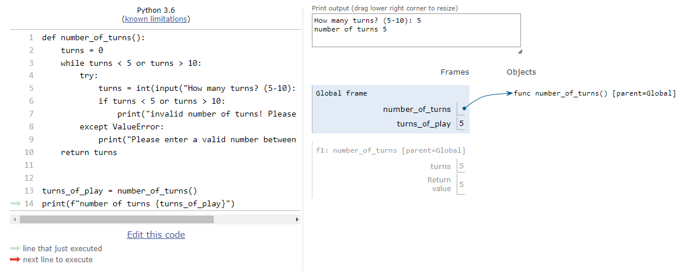

# Welcome to my version of the Battleship game.

### Ahoooooy Sailors! Ready to navigate some rough waters? 

####

## Visit the live project below.

* Your dependencies must be placed in the `requirements.txt` file

## Flow chart
]

## User Experience

 
## Game Features

## Design

## Technologies Used

## Testing

### Wrong referenching in the 
#### turns_of_play = number_of_turns()  
#### print(f"number of turns {turns_of_play}")  # wrong referenching <---- turns_of_play! 

### Corrected

## Bugs

## Deployment

## Credits

# Acknowledgments